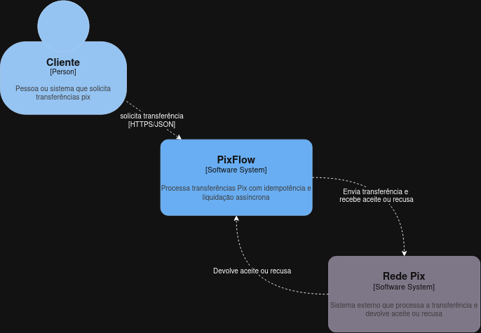
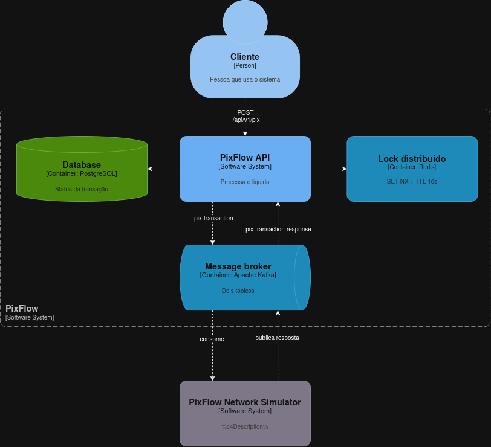

# PixFlow


Serviço de transferências Pix com idempotência e liquidação assíncrona. A API registra a transferência
como `PENDING`, envia para a rede Pix via Kafka e, quando a resposta chega, marca a transação como
`COMPLETED` ou `FAILED`.

## Arquitetura

**C4 nível 1 — Contexto**



**C4 nível 2 — Containers**



- **Hexagonal (Ports & Adapters):** o domínio não depende de framework; os casos de uso só conhecem interfaces.
- **Redis:** lock por chave de idempotência (`SET NX` + TTL), impedindo processamento duplicado em paralelo.
- **Kafka:** envio em `pix-transaction` e retorno em `pix-transaction-response`.
- **PostgreSQL:** fonte da verdade; uma requisição repetida devolve a transação já existente.

## Como executar

Pré-requisitos: Java 21 e Docker.

```bash
docker compose up -d
./mvnw spring-boot:run
```

A API fica disponível em `http://localhost:8080`.

## API

`POST /api/v1/pix`

```json
{
  "idempotencyKey": "9b1deb4d-3b7d-4bad-9bdd-2b0d7b3dcb6d",
  "sourceAccountId": "a1b2c3d4-e5f6-7a8b-9c0d-1e2f3a4b5c6d",
  "destinationKey": "fulano@email.com",
  "destinationKeyType": "EMAIL",
  "amount": 150.50
}
```

`destinationKeyType`: `CPF`, `CNPJ`, `EMAIL`, `PHONE` ou `RANDOM`.

Retorna `201 Created` com a transação em status `PENDING`.

## Testes

```bash
./mvnw test
```
